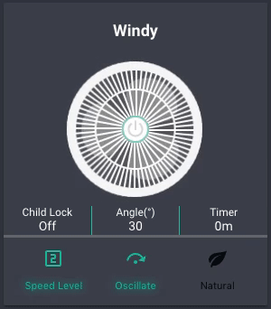
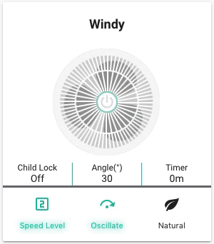

# Xiaomi Fan Lovelace Card
[](https://github.com/custom-components/hacs)

Xiaomi Smartmi Fan Lovelace card for HASS/Home Assistant.

+  Supports [HACS](https://github.com/custom-components/hacs) installation
+  Works seamlessly with the [syssi/xiaomi_fan](https://github.com/syssi/xiaomi_fan) integration
+  Animations of the fan are made purely with CSS

## HACS Installation
Search for `Xiaomi Smartmi Fan Card`

## Manual Installation
1. Download `fan-xiaomi.js`
1. Copy to `www\community\lovelace-fan-xiaomi\fan-xiaomi.js`
1. Add the following to your Lovelace resources
``` yaml
resources:
  - url: /community_plugin/lovelace-fan-xiaomi/fan-xiaomi.js
    type: js
```

## Examples



## Credits
[fineemb](https://github.com/fineemb) (Original author)

[shaonianzhentan](https://github.com/shaonianzhentan/)

[花神](https://github.com/yaming116)
